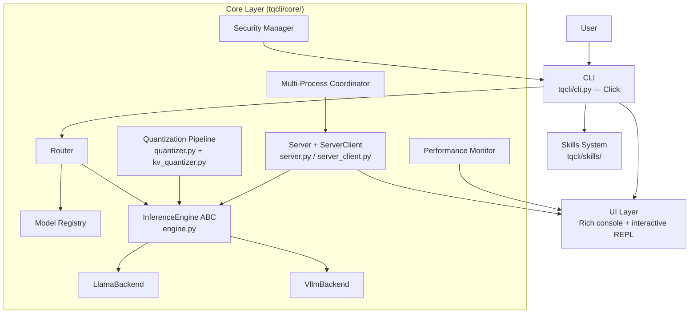

# tqCLI Architecture

Contributor documentation for tqCLI's internal design.

## Overview

tqCLI is a Python 3.10+ Click CLI that runs local LLM inference through
either llama.cpp or vLLM, with a unified quantization pipeline (weight
quant + TurboQuant KV cache compression), smart routing, performance
monitoring, and multi-process server support.

## Files in this folder

| File | Subsystem covered |
|------|-------------------|
| [`overview.md`](overview.md) | Module map + single-process / multi-process data flow |
| [`inference_engines.md`](inference_engines.md) | InferenceEngine ABC, LlamaBackend, VllmBackend, ServerClientBackend |
| [`quantization_pipeline.md`](quantization_pipeline.md) | Detect precision → weight quant → KV compression (PRD #10) |
| [`turboquant_kv.md`](turboquant_kv.md) | KVQuantLevel, per-engine dtype mapping, CUDA compat, per-layer head_dim routing |
| [`multi_process.md`](multi_process.md) | serve start/stop, workers, assess_multiprocess, engine-specific concurrency |
| [`skills_system.md`](skills_system.md) | SKILL.md discovery, builtin skills, tq-* skills inventory |
| [`security.md`](security.md) | Venv isolation, resource guards, audit log, unrestricted mode |

## Design principles

1. **One tqCLI binary for all CUDA versions** — TurboQuant KV is
   runtime-detected via `check_turboquant_compatibility`; unsupported
   systems gracefully degrade to `kv:none`.
2. **Abstract backends behind `InferenceEngine`** — routing, performance
   monitoring, and streaming logic live in engine-agnostic code.
3. **Pipeline-first quantization** — detect model precision, then pick
   weight-quant + KV-quant stages; never surprise the user with a silently
   truncated load.
4. **Non-destructive tests** — integration suites never remove models or
   uninstall the package (see `tests/integration_lifecycle.py`).

## Related reading

- [Getting Started](../GETTING_STARTED.md)
- [Usage examples](../examples/USAGE.md)
- Issue tracker: <https://github.com/ithllc/tqCLI/issues>
