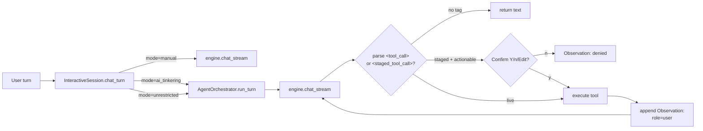

# Agent Orchestrator

tqCLI's agentic runtime. Sits between the CLI session and the inference
backends, turning a plain chat loop into a tool-using agent under two
opt-in modes.

Source: `tqcli/core/agent_orchestrator.py`, `tqcli/core/agent_tools.py`.

## Tri-state autonomy



- **manual** — `agent_mode="manual"`. Default. No tools injected, no tag
  parsing. JSON-stdout pipelines and CI are bit-identical to the pre-agent
  release.
- **ai_tinkering** — `agent_mode="ai_tinkering"`. Tool schemas injected.
  Model emits `<staged_tool_call>{...}</staged_tool_call>`. Orchestrator
  halts, asks `[Y/n/Edit]` for actionable tools, runs safe ones
  automatically. After execution, it threads an `Observation:` back as a
  new user turn and loops (bounded by `--max-agent-steps`).
- **unrestricted** — `agent_mode="unrestricted"`. Tool schemas injected.
  `<tool_call>{...}</tool_call>` blocks fire immediately. Loop terminates
  on plain-text reply or `max_steps`.

## Parsing

Two regexes, deliberately permissive on whitespace; the JSON parser
validates structure:

```python
_TAG_STAGED = re.compile(r"<staged_tool_call>\s*(.*?)\s*</staged_tool_call>", re.DOTALL)
_TAG_LIVE   = re.compile(r"<tool_call>\s*(.*?)\s*</tool_call>", re.DOTALL)
```

Non-dict payloads and missing `name` are rejected as malformed. Nested
JSON arguments (e.g., `{"meta": {"k": "v"}}`) parse correctly because the
regex delegates structure to `json.loads`.

## Tool schema

Each `AgentTool` subclass exposes:

| Attribute | Purpose |
|-----------|---------|
| `name` | LLM-visible tool identifier (`tq-file-read`, ...) |
| `description` | Natural-language hint |
| `safety` | `safe` \| `actionable` — drives the tinkering gate |
| `arg_schema` | OpenAI-compatible JSON Schema for parameters |
| `execute(args)` | Synchronous handler returning stdout |

Built-in tools:

| Tool | Safety | Purpose |
|------|--------|---------|
| `tq-file-read` | actionable | Read a UTF-8 file (gated because a read can exfiltrate `~/.ssh`, `.env`, etc.) |
| `tq-file-write` | actionable | Write / overwrite a UTF-8 file |
| `tq-terminal-exec` | actionable | Run a shell command, 120 s timeout, output truncated |
| `tq-interactive-prompt` | safe | Pause the loop and ask the user (supports secret input) |

## Observation feedback

Local Qwen 3 / Gemma 4 models do not reliably emit native `role=tool`
messages, so the orchestrator feeds results back as `role=user` turns
prefixed with `Observation:\n`. Output is truncated with a
**head+tail** strategy (500 chars each, configurable) because shell
errors usually land at the end of the stream.

## Safety gating

- `manual` injects no schema at all; the LLM has no awareness of tools.
- `ai_tinkering` requires explicit user approval for every `actionable`
  tool call, including `tq-file-read` (privacy exfiltration risk).
- `unrestricted` is equivalent to Claude Code's
  `--dangerously-skip-permissions` / Gemini CLI's `--yolo`. Audit logging
  remains on (per `unrestricted.py`).

## Testing

`tests/test_agent_orchestrator.py` covers the TP Phase 4 rubrics plus
regressions:

- Rubric #1 — tinkering denial blocks subprocess execution.
- Rubric #2 — yolo loop re-invokes `engine.chat_stream` after observation.
- Rubric #3 — manual mode yields `injected_tool_schemas == []`.
- Regression — nested JSON arguments.
- Regression — multi-step tinkering chain.
- Regression — `max_steps` bounds an infinite tool-emitting model.


## Stderr-ordering contract with the Engine Auditor (added in 0.7.0)

In agent modes (`--ai-tinkering` / unrestricted), the orchestrator emits
streamed `<tool_call>` tags to stdout while the Engine Auditor and other
startup chatter writes to stderr (or to stderr-redirected stdout in
`--json` mode). Rich buffers its output, so without an explicit flush
the auditor panel can interleave with the orchestrator's first stream
chunk and produce a garbled stream that confuses both human users and
downstream parsers.

`tqcli/cli.py` enforces this ordering: BEFORE constructing
`InteractiveSession` (and therefore the underlying `AgentOrchestrator`),
it calls `console.file.flush()` so the panel's last newline lands in
stderr before any orchestrator tag is written.

This is asserted in `tests/test_engine_auditor.py::test_render_then_flush_finishes_before_orchestrator_first_chunk`
— the canonical regression test for the contract.
