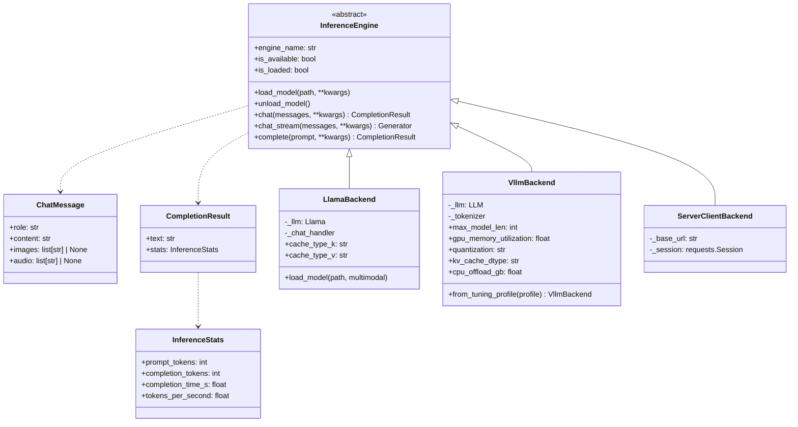

# Inference Engines

tqCLI abstracts every backend behind `tqcli/core/engine.py::InferenceEngine`.
Three concrete implementations live in `tqcli/core/`:

| Class | File | Transport | Hardware |
|-------|------|-----------|----------|
| `LlamaBackend` | `llama_backend.py` | In-process llama-cpp-python | CPU, CUDA, Metal, Vulkan |
| `VllmBackend` | `vllm_backend.py` | In-process vLLM | Linux + NVIDIA CUDA 12.8+ |
| `ServerClientBackend` | `server_client.py` | HTTP (OpenAI-compatible) | Any (connects to a server process) |

## Class hierarchy

## LlamaBackend

Wraps `llama-cpp-python`. Key responsibilities:

- **Multimodal** — when `multimodal=True` is passed to `load_model`, the
  backend installs a chat handler (CLIP or MiniCPM-V) and turns
  `ChatMessage.images` + `ChatMessage.audio` into OpenAI-style multimodal
  content lists (`{"type": "image_url"}`, `{"type": "input_audio"}`).
- **TurboQuant KV** — `cache_type_k` / `cache_type_v` accept `f16`, `q8_0`,
  `turbo4`, `turbo3`, `turbo2`. Requires llama.cpp built from
  [`ithllc/llama-cpp-turboquant`](https://github.com/ithllc/llama-cpp-turboquant)
  with CUDA 12.8+.
- **Streaming** — native generator from llama-cpp-python; `chat_stream`
  yields `(chunk, stats_or_None)` and emits the final `InferenceStats`
  object on the last iteration.

## VllmBackend

Wraps the vLLM `LLM` class. Key responsibilities:

- **Hardware tuning profile** — `VllmBackend.from_tuning_profile(profile)`
  constructs the backend from a `VllmTuningProfile` built by
  `tqcli/core/vllm_config.py::build_vllm_config`. The profile captures
  `max_model_len`, `gpu_memory_utilization`, `enforce_eager`,
  `cpu_offload_gb`, `kv_cache_memory_bytes`, `quantization` (bnb,
  awq_marlin, etc.), `load_format`, `kv_cache_dtype`.
- **TurboQuant KV** — if `kv_cache_dtype` matches the TurboQuant registry
  (via `vllm.v1.attention.ops.turboquant_kv_cache.is_turboquant_kv_cache`),
  the backend passes `enable_turboquant=True` to the engine. Requires
  vLLM built from
  [`ithllc/vllm-turboquant`](https://github.com/ithllc/vllm-turboquant)
  with the four page-size unification patches (see
  `patches/vllm-turboquant/issue_22_page_size_fix.md`).
- **CPU offload** — pass-through of `cpu_offload_gb` to enable the UVA
  offloader (#20). Used for Gemma 4 E2B on 4 GB VRAM.
- **Streaming** — vLLM's synchronous API returns the full response, so
  `chat_stream` emits the whole text as a single chunk plus final stats.
- **Multimodal** — TBD. `_messages_to_dicts` currently strips `images` /
  `audio`. The fix is specified in
  [`docs/prompts/implement_headless_chat_and_vllm_multimodal.md`](../prompts/implement_headless_chat_and_vllm_multimodal.md).

## ServerClientBackend

Delegates inference to a running HTTP server (llama.cpp or vLLM) via the
OpenAI-compatible `/v1/chat/completions` endpoint. Used by multi-process
workers. Supports both non-streaming and SSE streaming; routes the stream
iterator back through `chat_stream` so workers look identical to
single-process callers.

## Adding a new backend

1. Create `tqcli/core/<name>_backend.py`.
2. Subclass `InferenceEngine` and implement: `engine_name`, `is_available`,
   `is_loaded`, `load_model`, `unload_model`, `chat`, `chat_stream`,
   `complete`.
3. If the new backend has hardware-specific tuning, mirror
   `vllm_config.py::build_vllm_config` and expose a `from_tuning_profile`
   classmethod.
4. Wire it into `cli.py` `chat --engine` Click choice list.
5. Add an optional dependency group in `pyproject.toml`.
6. Add integration coverage in `tests/test_integration_turboquant_kv.py`
   (pipeline planning) and a backend-specific integration helper.
