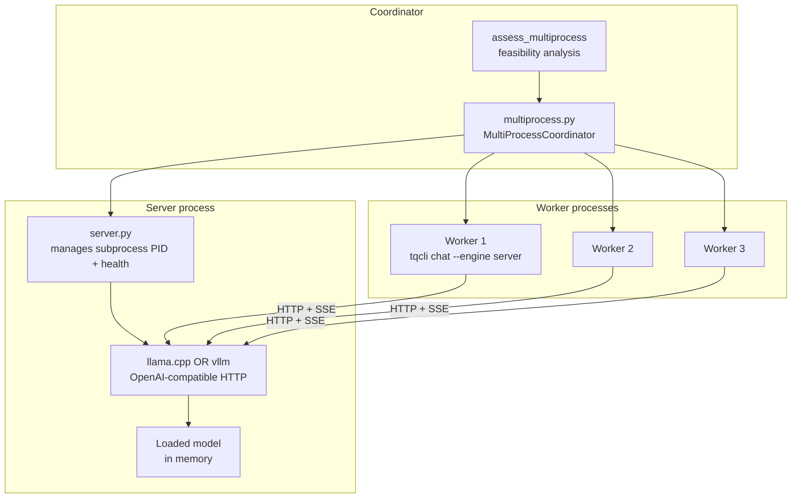
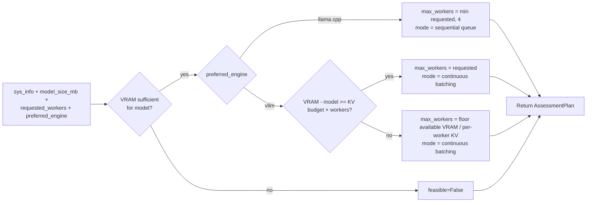
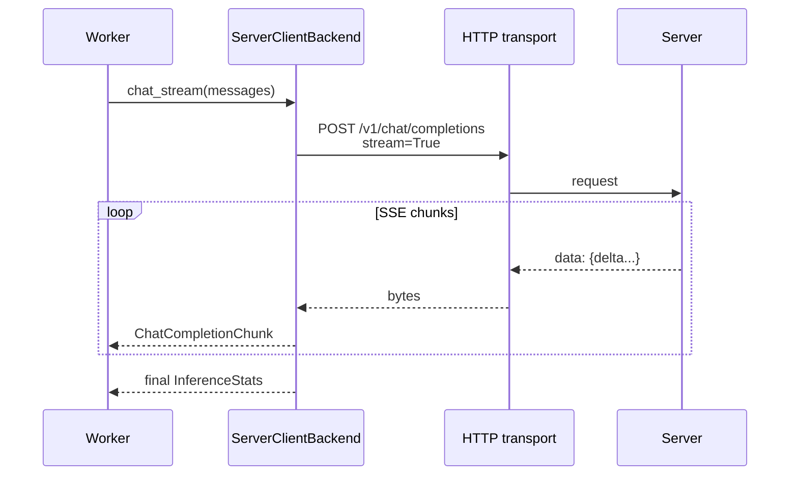

# Multi-Process Mode

tqCLI supports a single shared inference server + N worker processes. The
server holds the model; workers keep only the conversation history and
stream tokens over HTTP (SSE).

## Components

## Engine-specific concurrency

| Engine | Concurrency model | Throughput shape |
|--------|-------------------|------------------|
| llama.cpp | Sequential queue (server processes one request at a time) | Saturates at ~1 request in flight |
| vLLM | Continuous batching + PagedAttention | Multiple requests share GPU, throughput rises with concurrency up to KV budget |

This is why vLLM is the recommended server for commercial multi-tenant
workloads. The `--engine server` flag inside `tqcli chat` does not need
to know which server engine is running — it just speaks
OpenAI-compatible HTTP via `ServerClientBackend`.

## `assess_multiprocess`

`tqcli/core/multiprocess.py::assess_multiprocess` is pure Python — it
evaluates hardware feasibility for N workers and returns a plan object:

Unrestricted mode (`--stop-trying-to-control-everything-and-just-let-go`)
passes `unrestricted=True` and skips the VRAM feasibility check — the
coordinator still reports its findings, but will not refuse to start.

## Lifecycle commands

| Command | What it does |
|---------|--------------|
| `tqcli serve start -m <model-id> [-e llama.cpp|vllm]` | Start the server subprocess (port 8741 by default) |
| `tqcli serve status` | Report PID, engine, health, uptime |
| `tqcli serve stop` | Send SIGTERM to the server subprocess and wait for clean exit |
| `tqcli workers spawn 3` | Spawn three worker processes pointing at the server |
| `tqcli chat --engine server` | Interactive chat as a single worker |

All of these are verified-available in the integration test lifecycle
(`tests/integration_lifecycle.py::step_serve_lifecycle` — run
`TQCLI_TEST_SERVER=1` to exercise the real start/stop cycle).

## Server = OpenAI-compatible endpoint

Both `llama-cpp-python[server]` and vLLM's OpenAI API server expose
`/v1/chat/completions`. `ServerClientBackend` is a thin wrapper over
`requests`:

## Failure modes

- **Server not running** → `tqcli serve status` reports clearly; workers
  raise on first request with a human-readable error.
- **Server crashed mid-stream** → worker receives an incomplete SSE
  stream; `PerformanceMonitor` flags the stats as incomplete; handoff
  offered.
- **Port conflict** → `tqcli serve start` refuses to start; pass
  `--port 8742` to override.
