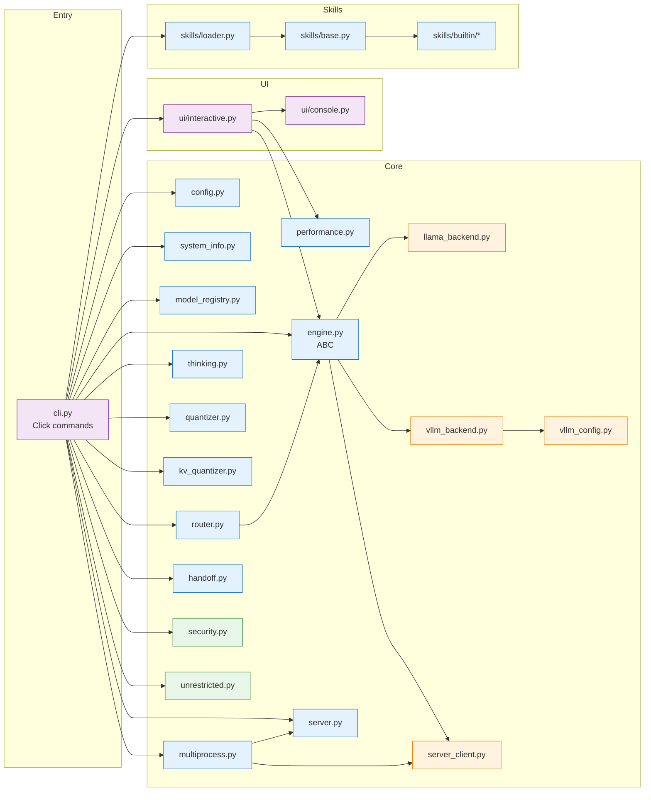
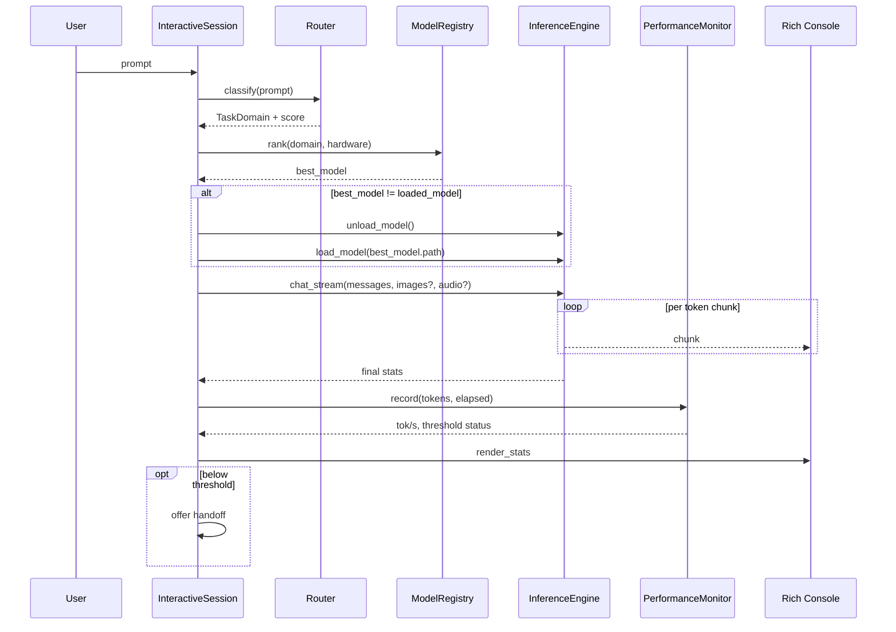
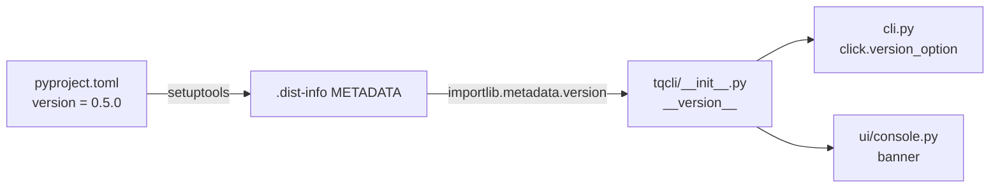

# Architecture Overview

## Module map



## Runtime boundaries

- **Startup fast path:** `cli.py` imports are lazy; `system info` and
  `model list` avoid importing llama-cpp or vllm.
- **Inference hot path:** `InteractiveSession` → `InferenceEngine.chat_stream`
  → backend → tokens streamed to `ui/console.py`.
- **Async boundaries:** none. tqCLI is synchronous. Server mode uses
  blocking HTTP via `requests` and streaming via SSE iterator.

## Data flow — single-process chat



## Data flow — multi-process chat

```mermaid
sequenceDiagram
    participant Op as Operator
    participant MP as MultiProcessCoordinator
    participant SRV as InferenceServer
    participant W1 as Worker 1
    participant W2 as Worker 2
    participant ENG as In-server Engine

    Op->>MP: tqcli serve start -m MODEL
    MP->>SRV: spawn (llama.cpp or vLLM OpenAI-compatible)
    SRV->>ENG: load_model
    Note over SRV,ENG: Server holds the model;<br/>workers hold only ChatHistory.

    Op->>W1: tqcli chat --engine server
    Op->>W2: tqcli chat --engine server
    par Worker 1
        W1->>SRV: POST /v1/chat/completions (SSE)
        SRV-->>W1: tokens
    and Worker 2
        W2->>SRV: POST /v1/chat/completions (SSE)
        SRV-->>W2: tokens
    end
    Note over SRV: vLLM: continuous batching<br/>llama.cpp: sequential queue

    Op->>MP: tqcli serve stop
    MP->>SRV: SIGTERM
```

## Configuration surface

All runtime knobs come from `~/.tqcli/config.yaml` loaded by
`tqcli/config.py` into a `TqConfig` dataclass. Nested groups:

- `performance` — tok/s thresholds + handoff triggers
- `security` — venv, sandbox, audit log, resource percentages
- `router` — router enable + preferences
- `multiprocess` — host/port, max_workers, auto_start_server

CLI flags override config at invocation time
(e.g. `tqcli --stop-trying-to-control-everything-and-just-let-go …`).

## Versioning

`tqcli/__init__.py` resolves `__version__` from installed package metadata
via `importlib.metadata.version("tqcli")`, falling back to a hard-coded
string for source-of-truth development. `pyproject.toml` is the single
source of truth for the published version.


