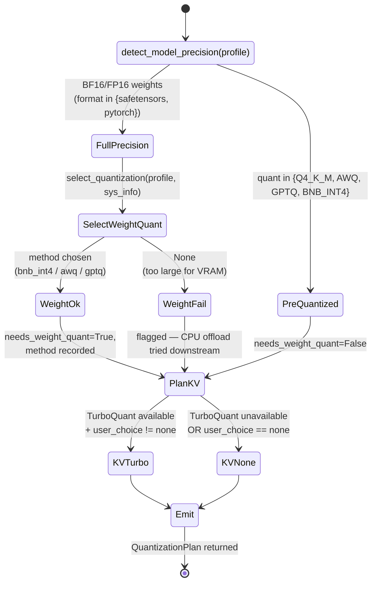

# Unified Quantization Pipeline

The pipeline turns "I want to run model X" into a concrete backend
configuration with a weight-quant stage and/or a TurboQuant KV stage,
never both surprise-applied at load time.

Source of truth: `tqcli/core/kv_quantizer.py::plan_quantization_pipeline`
(+ `tqcli/core/quantizer.py` for weight quantization selection).

Driven by PRD #10 (quantization pipeline) and PRD #13 (TurboQuant KV).

## State machine

## The plan object

`plan_quantization_pipeline(...)` returns a dataclass with:

| Field | Type | Purpose |
|-------|------|---------|
| `model_precision` | str | `full_precision` / `weight_quantized` / `unknown` |
| `needs_weight_quant` | bool | True only for BF16/FP16 models |
| `weight_quant_method` | str or None | `bnb_int4`, `awq`, `gptq`, or None |
| `needs_kv_compression` | bool | True when TurboQuant is available + user didn't opt out |
| `kv_level` | KVQuantLevel | `none` / `turbo4` / `turbo3` / `turbo2` |
| `stages_applied` | list[str] | e.g. `["detect", "weight:bnb_int4", "cpu_offload", "kv:turboquant35"]` |
| `summary` | str | Human-readable one-liner printed in logs |
| `weight_quant_reason` | str | Why this method was chosen |
| `kv_reason` | str | Why this KV level was chosen |

## Path examples

| Scenario | Model | Pipeline summary |
|----------|-------|------------------|
| llama.cpp Q4_K_M | `qwen3-4b-Q4_K_M` | `detect pre_quantized → kv:turbo3` |
| llama.cpp pre-quantized Gemma 4 | `gemma-4-e4b-it-Q4_K_M` | `detect pre_quantized → kv:turbo3` |
| vLLM AWQ | `qwen3-4b-AWQ` | `detect pre_quantized → kv:turboquant35` |
| vLLM BF16 Qwen 3 | `qwen3-4b-vllm` | `detect full_precision → weight:bnb_int4 → kv:turboquant35` |
| vLLM BF16 Gemma 4 E2B | `gemma-4-e2b-it-vllm` | `detect full_precision → weight:bnb_int4 → cpu_offload → kv:turboquant35` |

The last row — Gemma 4 E2B on 4 GB VRAM — is the one that required #20
(CPU offload) + #22 (page-size fix) to close. The integration test for
it is `tests/test_integration_turboquant_kv.py::test_7_gemma4_e2b_vllm_cpu_offload`.

## Integration with `VllmTuningProfile`

For vLLM models, the plan feeds
`tqcli/core/vllm_config.py::build_vllm_config(profile, sys_info,
requested_max_len, kv_quant_choice)` which produces a `VllmTuningProfile`
containing the exact vLLM engine kwargs. `VllmBackend.from_tuning_profile`
consumes the profile directly — there is no mutable state between the
plan and the engine.

## Graceful degradation

`check_turboquant_compatibility(sys_info)` gates the KV stage. On CUDA
< 12.8 or SM < 86, the pipeline falls back to `kv:none` and logs a
warning. The rest of the plan (weight quant, CPU offload) continues to
apply. This is what keeps "one tqCLI binary for all CUDA versions"
truthful.
