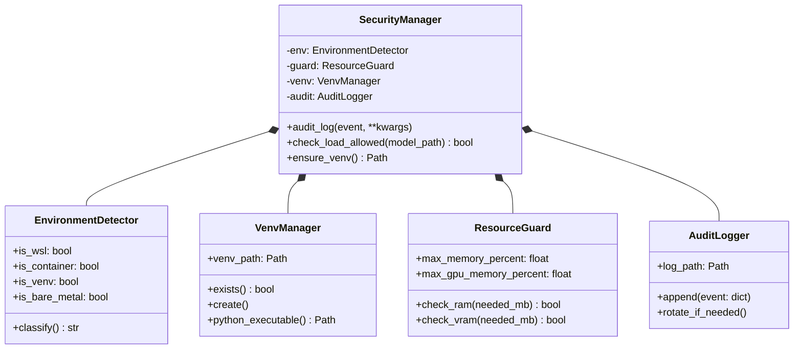
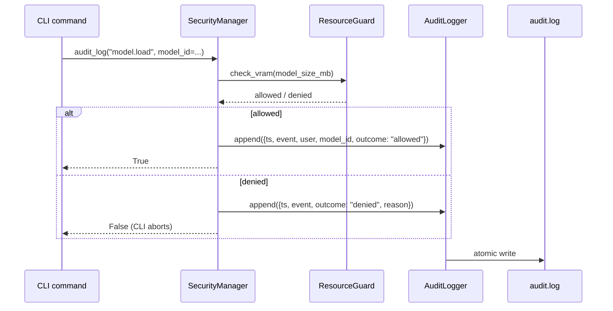
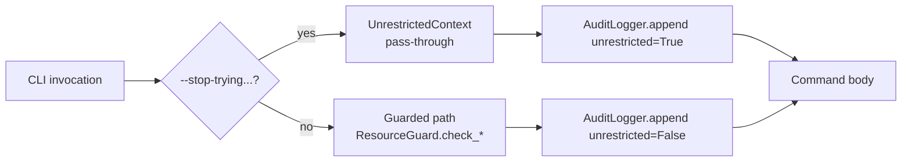

# Security Layer

Everything under `tqcli/core/security.py` + `tqcli/core/unrestricted.py`.
Inspired by Claude Code's permission model — **sandbox by default, allow
explicit override for experienced users**.

## Components



## Audit log

Every model load, download, skill execution, server start/stop, and
unrestricted-mode invocation is appended as a JSON object to
`~/.tqcli/audit.log` (JSON Lines). The log is append-only — tqCLI never
edits or truncates historical records. Tooling can tail it for SIEM
integration.



## Resource guards

Hard thresholds from `~/.tqcli/config.yaml::security`:

- `max_memory_percent` — default 80%; prevents OOM by refusing to load a
  model whose peak estimated RAM exceeds this fraction.
- `max_gpu_memory_percent` — default 90%; same concept for VRAM.
- `sandbox_enabled` — if True, blocks loading models outside
  `~/.tqcli/models/`.
- `use_venv` — if True, `SecurityManager.ensure_venv()` creates
  `~/.tqcli/venv` on first run.

Resource guards kick in before heavy IO starts. The integration tests
use them via the normal CLI — no special test hooks.

## Unrestricted mode

The `--stop-trying-to-control-everything-and-just-let-go` flag (aka
"yolo mode") bypasses:

- VRAM / RAM feasibility checks
- Confirmation prompts
- Worker-count caps

It does **not** bypass:

- Audit logging (every unrestricted invocation is still recorded)
- Download integrity checks
- Unsafe path / file permission checks



Equivalent to Claude Code's `--dangerously-skip-permissions` and Gemini
CLI's `--yolo`.

## Environment detection

`EnvironmentDetector` classifies the host as `wsl2`, `container` (Docker,
Kubernetes), `venv` (pip-installed inside an activated venv), or
`bare-metal`. This drives:

- **WSL2 quirks** — vLLM uses `spawn` multiprocess start method (NVML is
  not fork-compatible on WSL2); `pin_memory=False` to avoid slowdowns.
- **Container checks** — if no cgroup limits are set, resource guards
  downgrade to RAM-visible estimates instead of container-limited ones.
- **Recommended engine** — WSL2 + NVIDIA → vLLM; macOS Apple Silicon →
  llama.cpp with Metal.

## Running a security audit

```bash
tqcli security audit              # read-only report
tqcli security audit --fix        # auto-fix safe issues (create venv, etc.)
```

Covered by the `tq-security-audit` skill and integration tests — see
`.claude/skills/tq-security-audit/`.
