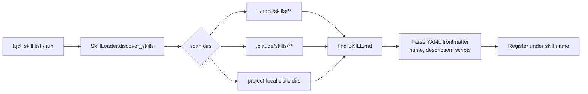
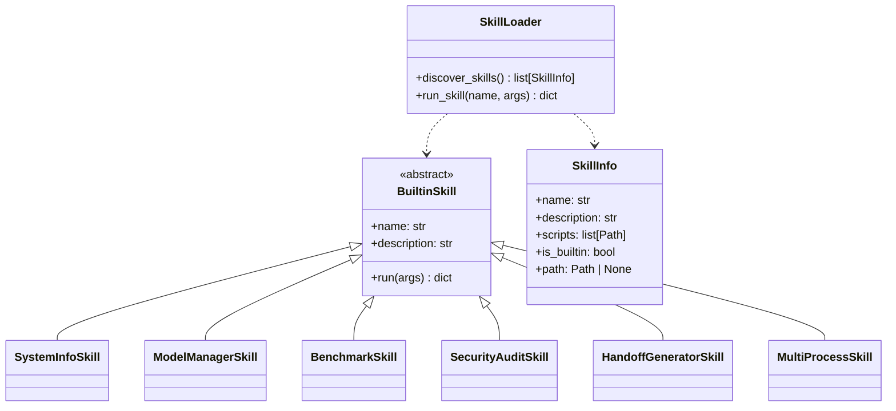

# Skills System

tqCLI mirrors Claude Code's skill architecture — skills are
self-contained markdown-documented capabilities that the CLI can list,
invoke, and generate.

Source: `tqcli/skills/` (loader + base + builtin) and
`.claude/skills/` (skill definitions on disk).

## Discovery



Every skill is a directory containing:

```
my-skill/
├── SKILL.md          # YAML frontmatter + prose
└── scripts/          # optional — auto-executed scripts
    └── run_my_skill.py
```

`SKILL.md` frontmatter fields that tqCLI reads:

| Field | Meaning |
|-------|---------|
| `name` | Unique skill identifier |
| `description` | Shown in `tqcli skill list` and used for matching |
| `scripts` | Optional list (or auto-discovered under `scripts/`) |
| `trigger` | Optional natural-language matching hint |

## Builtin vs disk skills



- **Builtin skills** — Python classes in `tqcli/skills/builtin/` that
  provide fixed capability (`tq-system-info`, `tq-model-manager`, etc.).
- **Disk skills** — discovered via `SKILL.md` scan. These are the
  preferred mechanism for user-created and team-shared skills.

## The tq-* skill inventory

tqCLI-specific skills live under `.claude/skills/`:

| Skill | Purpose |
|-------|---------|
| `tq-system-info` | Detect OS + hardware, recommend engine + quant level |
| `tq-model-manager` | Download, list, remove, validate models |
| `tq-benchmark` | Tokens/second benchmarks + head-to-head comparison |
| `tq-security-audit` | Environment isolation + audit log integrity |
| `tq-handoff-generator` | Generate frontier-CLI handoff markdown |
| `tq-multi-process` | Multi-process orchestration + resource assessment |
| `tq-model-updater` | Refresh model registry from HuggingFace |

## Running a skill

```bash
tqcli skill create my-smoke-skill -d "smoke test"
tqcli skill list          # appears under "Available Skills"
tqcli skill run my-smoke-skill
# => {"skill": "my-smoke-skill", "status": "completed", ...}
```

`tqcli skill run` executes the script under `scripts/` and expects it to
emit a JSON object with at least `status`. The integration lifecycle
helper (`tests/integration_lifecycle.py::step_skill_run`) asserts
`"status": "completed"` in the skill's stdout.

## Adding a new skill

### Option 1 — disk skill (recommended)

```bash
tqcli skill create my-skill -d "What my skill does"
# Edit ~/.tqcli/skills/my-skill/SKILL.md and scripts/ as needed
```

### Option 2 — builtin skill

1. Create `tqcli/skills/builtin/my_skill.py`.
2. Subclass `BuiltinSkill`; implement `run(args)` returning a dict.
3. Register in `tqcli/skills/builtin/__init__.py`.
4. Add a discovery test.
