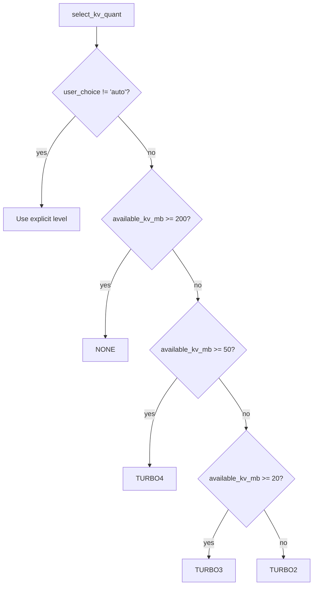
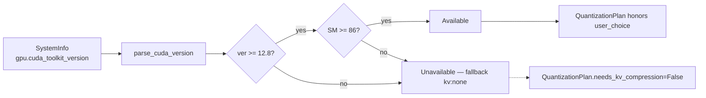
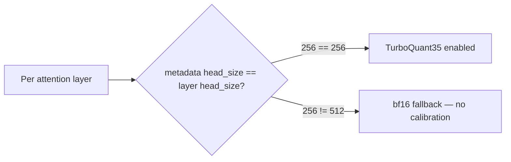
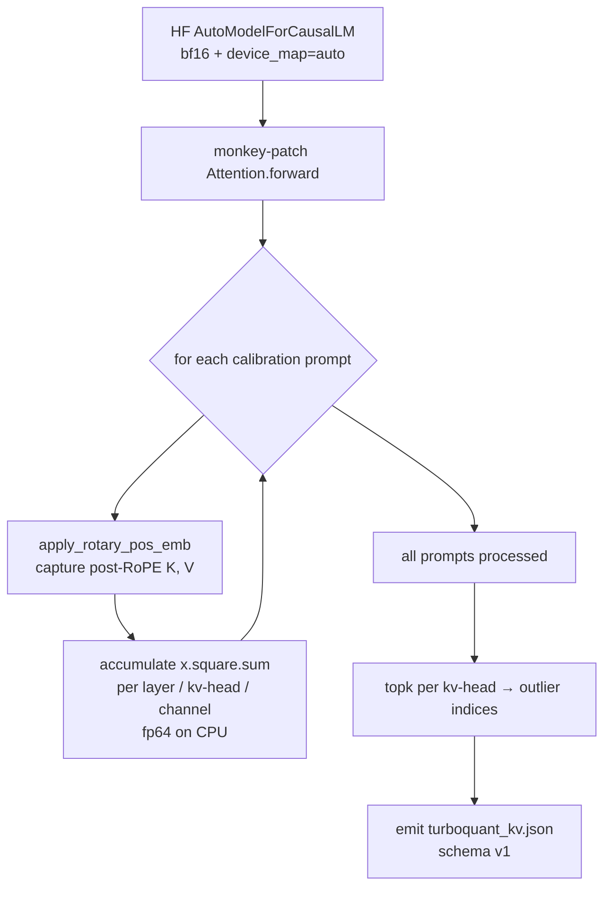

# TurboQuant KV Cache Compression

TurboQuant is a runtime KV cache compression technique from Google
Research (ICLR 2026): PolarQuant + Walsh-Hadamard rotation on keys, QJL
(Johnson-Lindenstrauss sign-bit) on values. Weights are unchanged —
only attention cache is compressed during inference.

Papers:
- TurboQuant — <https://arxiv.org/abs/2504.19874>
- PolarQuant — <https://arxiv.org/abs/2502.02617>

Forks used by tqCLI:
- llama.cpp — <https://github.com/tqcli/llama-cpp-turboquant>
- vLLM — <https://github.com/tqcli/vllm-turboquant>

## Compression levels

Defined in `tqcli/core/kv_quantizer.py::KVQuantLevel`:

| Level | Bits / value | Compression vs q8_0 | PPL impact |
|-------|-------------:|--------------------:|-----------:|
| `none` (q8_0 / f16) | 8.5 | 1.0× | Baseline |
| `turbo4` | 4.25 | 3.8× | +0.23% |
| `turbo3` | 3.5 | 4.6× | +1.06% |
| `turbo2` | 2.5 | 6.4× | +6.48% |

Auto-selection by `select_kv_quant(available_kv_mb, engine, user_choice)`:



## Per-engine dtype mapping

`get_llama_kv_params` and `get_vllm_kv_params` emit engine-specific config:

| KVQuantLevel | llama.cpp | vLLM |
|--------------|-----------|------|
| `NONE` | `cache_type_k=f16, cache_type_v=f16` | `{}` (vLLM `auto`) |
| `TURBO4` | `cache_type_k=turbo4, cache_type_v=turbo4` | `kv_cache_dtype=turboquant35, enable_turboquant=True, attention_backend=TRITON_ATTN` |
| `TURBO3` | `cache_type_k=turbo3, cache_type_v=turbo3` | same as TURBO4 (turboquant35) |
| `TURBO2` | `cache_type_k=turbo2, cache_type_v=turbo2` | `kv_cache_dtype=turboquant25, enable_turboquant=True, attention_backend=TRITON_ATTN` |

`turboquant35` covers both 3.5 bpv and 4.25 bpv cases at the vLLM layer —
the fork packs K/V with the same layout and lets the kernel reconstruct.

## CUDA compatibility gate



Verified compatibility matrix is in `check_turboquant_compatibility`.
Unsupported systems fall back to `kv:none` without crashing — this is
what allows a single tqCLI binary to ship to all CUDA versions.

## Per-layer head_dim routing (Gemma 4)

Gemma 4 has two head-dim profiles within the same model:



- **Sliding-window layers** (head_dim 256) → TurboQuant35 active. There
  are 28 such layers on Gemma 4 E2B.
- **Full-attention layers** (head_dim 512) → bf16 (no TurboQuant
  calibration metadata). There are 7 such layers.

Confirmed by `test_7_gemma4_e2b_vllm_cpu_offload` logs:

```
[triton_attn.py:656] TurboQuant enabled for layer ...layers.0.self_attn.attn with turboquant35
...
[triton_attn.py:620] TurboQuant metadata head_size (256) != layer head_size (512) for ...layers.4.self_attn.attn. Disabling TurboQuant for this layer.
```

## Metadata: `turboquant_kv.json` per-model sidecar (vLLM)

The vLLM fork requires per-layer, per-KV-head outlier-channel indices in
`<model_dir>/turboquant_kv.json` for any `turboquant*` recipe. Without
the file, `TritonAttentionImpl.__init__` raises
`ValueError: TurboQuant KV cache requires metadata...` at
`vllm/v1/attention/backends/triton_attn.py:600`.

Schema (version 1):

| Field | Meaning |
|---|---|
| `recipe` | `turboquant25` (2.5 bpv, outlier ratio 0.25) or `turboquant35` (3.5 bpv, ratio 0.50) |
| `head_size` | Attention head dimension; must be `% 16 == 0` |
| `transform_version` | `structured_hadamard_v1` — block-decomposed FWHT + deterministic-seeded random ±1 sign flip |
| `codebook_version` | `lloyd_beta_v1` — baked into the Triton kernels, not this file |
| `layers.<name>.key_high_precision_indices` | Shape `[num_kv_heads, outlier_count]`; integer indices in `[0, head_size)` |
| `layers.<name>.value_high_precision_indices` | Same shape; independent selection |

Outlier count: `round(head_size × ratio / 16) × 16`.

## Activation-based metadata auto-calibration (0.6.1+)

For vLLM models that don't ship a calibrated `turboquant_kv.json`,
`tqcli/core/kv_metadata_generator.py` runs the calibration locally.
Mirrors the fork's own reference selector at
`vllm/v1/attention/ops/turboquant_kv_cache.py::build_turboquant_outlier_masks`
— score each channel by mean-squared activation, pick top-k per kv-head,
sort ascending.



**Entry points:**
- Explicit: `tqcli model calibrate-kv <model-id> [--recipe turboquant{25,35}] [--force]`
- Implicit: `VllmBackend.load_model` auto-runs calibration on first load
  when metadata is missing and `kv_cache_dtype.startswith("turboquant")`

**Preconditions refused** (with clear reason strings via
`check_calibration_preconditions`):
- Pre-quantized source weights (AWQ / GPTQ / bnb) — activation statistics
  on already-scaled weights bias the variance estimate
- Variable head_dim (Gemma 4 sliding=256 / global=512) — schema is single-head_size
- `head_dim % 16 != 0`
- Architectures without a registered capture wrapper

**Architecture registry** (`_CAPTURE_INSTALLERS` in `kv_metadata_generator.py`):
- ✅ `Qwen3ForCausalLM` — post-RoPE capture via patched `Qwen3Attention.forward`
  (with q_norm/k_norm).
- ✅ `LlamaForCausalLM` — patched `LlamaAttention.forward`, separate q/k/v
  projections, no q_norm/k_norm. Validated on `SmolLM2-135M-Instruct`.
- ✅ `MistralForCausalLM` — patched `MistralAttention.forward`. Identical shape
  to Llama; `sliding_window` is an attention-mask concern and doesn't affect
  K/V capture shape. Validated on `TinyMistral-248M`.
- ✅ `Phi3ForCausalLM` — patched `Phi3Attention.forward` with fused `qkv_proj`
  slicing at `(n_heads × head_dim, n_kv × head_dim, n_kv × head_dim)`.
  Validated on `Phi-3-mini-4k-instruct`.

**head_dim derivation**: Llama 3 / Mistral / Phi-3 / SmolLM2 configs omit
an explicit `head_dim` field. `_extract_architecture_params` derives
`head_dim = hidden_size // num_attention_heads` when absent. Qwen3 / Gemma 4
configs that set `head_dim` explicitly are unaffected.

**Calibration corpus**: 30 paragraph-length, domain-diverse prompts in
`DEFAULT_CALIBRATION_PROMPTS` (code, math, prose, technical, dialog, misc).
~5,100 Qwen3 tokens observed total; `MIN_OBSERVED_TOKENS=5_000` enforced by
`tests/test_kv_metadata_corpus.py`.

**PPL validation gate** (`tests/test_kv_ppl_validation.py`, opt-in via
`TQCLI_PPL_GATE=1`): asserts `PPL(turboquant35) / PPL(kv:auto) <= 1.05`
over a fixed 10-prompt corpus, catching silent quality collapse from bad
outlier indices. Current measured ratio: **0.9997** (essentially
indistinguishable from baseline).

## MLA (DeepSeek V3) — intentionally unsupported

Multi-head Latent Attention stores K/V as a single shared latent vector
plus a decoupled-K for RoPE; per-head K/V tensors do not exist at cache
time. TurboQuant's per-head Hadamard rotation + per-channel outlier
selection cannot apply to the latent without destroying the algebraic
structure required by the up-projection matrices. vLLM's MLA path also
uses dedicated kernels (FlashMLA / MLA-specific triton) that would not
honor `kv_cache_dtype=turboquant*` even if metadata existed.

For MLA models, use `kv_cache_dtype=fp8` (supported by vLLM upstream on
the MLA path). See [#33](https://github.com/ithllc/tqCLI/issues/33) for
the full research summary.

## End-to-end verified numbers (2026-04-17 run)

From `tests/integration_reports/turboquant_kv_comparison_report.md`
(Section C.2 — Gemma 4 E2B on 4 GB VRAM + CPU offload + turboquant35):

| Metric | Value |
|--------|-------|
| Load time | 624.5 s |
| `cpu_offload_gb` | 9.9 |
| `kv_cache_dtype` | turboquant35 |
| TurboQuant layers | 28 sliding-window (of 35 total) |
| KV cache size | 4,368 tokens at 64 MiB |
| Max concurrency | 4.21× @ 2,048 ctx |
| Thinking turn | "15% of 240 is 36" (correct) |
| Simple turn | "Paris" (correct) |


## Distribution

As of tqCLI 0.7.0, the TurboQuant forks are shipped as installable wheels.
Users no longer need to clone the fork repos and build from source.

| Fork | Wheel hosting | Install command |
|------|---------------|-----------------|
| `llama-cpp-python-turboquant` | PyPI (cibuildwheel matrix: Linux/macOS/Windows × Py 3.10–3.12 × CPU/CUDA/Metal) | `pip install 'turboquant-cli[llama-tq]'` |
| `vllm-turboquant` (Ampere/Ada/Hopper) | GitHub Release on `tqcli/vllm-turboquant`, single CUDA 12.8 build | `pip install 'turboquant-cli[vllm-tq]' --find-links https://github.com/tqcli/vllm-turboquant/releases/latest` |
| `vllm-turboquant-blackwell` (sm_100 / sm_120 / sm_121) | GitHub Release, separate CUDA 13.0 build with PTX hedge for Rubin | `pip install 'turboquant-cli[vllm-tq-blackwell]' --find-links https://github.com/tqcli/vllm-turboquant/releases/latest` |

The architecture target list for the CUDA 13.0 build is
`TORCH_CUDA_ARCH_LIST="8.0 8.6 8.9 9.0 10.0 12.0 12.1+PTX"` — Ampere + Ada
+ Hopper + DC Blackwell (sm_100) + consumer Blackwell (sm_120) + DGX Spark
/ GB10 (sm_121) + a PTX hedge for Rubin. CUDA 12.8 cannot compile sm_121,
which is why the toolkit moved to 13.0 for 0.7.0.

Each engine carries a sentinel attribute that tqCLI's Engine Auditor reads
at startup to detect fork-vs-upstream:

| Engine | Sentinel | Module |
|--------|----------|--------|
| llama.cpp | `TURBOQUANT_BUILD = True` | `llama_cpp` |
| vLLM | `TURBOQUANT_ENABLED = True` | `vllm` |

When the sentinel is missing on capable hardware, the auditor prints a
yellow Rich panel with the exact `pip install` command — see
[`inference_engines.md`](./inference_engines.md) for the auditor's full
flow and the stderr-flush ordering contract used in agent modes.
