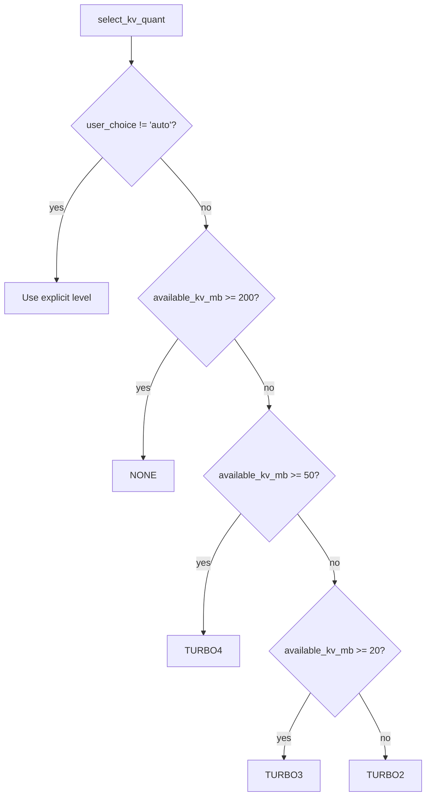
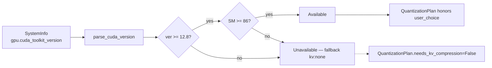
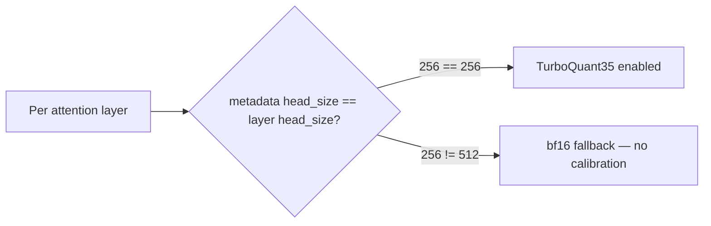

# TurboQuant KV Cache Compression

TurboQuant is a runtime KV cache compression technique from Google
Research (ICLR 2026): PolarQuant + Walsh-Hadamard rotation on keys, QJL
(Johnson-Lindenstrauss sign-bit) on values. Weights are unchanged —
only attention cache is compressed during inference.

Papers:
- TurboQuant — <https://arxiv.org/abs/2504.19874>
- PolarQuant — <https://arxiv.org/abs/2502.02617>

Forks used by tqCLI:
- llama.cpp — <https://github.com/ithllc/llama-cpp-turboquant>
- vLLM — <https://github.com/ithllc/vllm-turboquant>

## Compression levels

Defined in `tqcli/core/kv_quantizer.py::KVQuantLevel`:

| Level | Bits / value | Compression vs q8_0 | PPL impact |
|-------|-------------:|--------------------:|-----------:|
| `none` (q8_0 / f16) | 8.5 | 1.0× | Baseline |
| `turbo4` | 4.25 | 3.8× | +0.23% |
| `turbo3` | 3.5 | 4.6× | +1.06% |
| `turbo2` | 2.5 | 6.4× | +6.48% |

Auto-selection by `select_kv_quant(available_kv_mb, engine, user_choice)`:



## Per-engine dtype mapping

`get_llama_kv_params` and `get_vllm_kv_params` emit engine-specific config:

| KVQuantLevel | llama.cpp | vLLM |
|--------------|-----------|------|
| `NONE` | `cache_type_k=f16, cache_type_v=f16` | `{}` (vLLM `auto`) |
| `TURBO4` | `cache_type_k=turbo4, cache_type_v=turbo4` | `kv_cache_dtype=turboquant35, enable_turboquant=True, attention_backend=TRITON_ATTN` |
| `TURBO3` | `cache_type_k=turbo3, cache_type_v=turbo3` | same as TURBO4 (turboquant35) |
| `TURBO2` | `cache_type_k=turbo2, cache_type_v=turbo2` | `kv_cache_dtype=turboquant25, enable_turboquant=True, attention_backend=TRITON_ATTN` |

`turboquant35` covers both 3.5 bpv and 4.25 bpv cases at the vLLM layer —
the fork packs K/V with the same layout and lets the kernel reconstruct.

## CUDA compatibility gate



Verified compatibility matrix is in `check_turboquant_compatibility`.
Unsupported systems fall back to `kv:none` without crashing — this is
what allows a single tqCLI binary to ship to all CUDA versions.

## Per-layer head_dim routing (Gemma 4)

Gemma 4 has two head-dim profiles within the same model:



- **Sliding-window layers** (head_dim 256) → TurboQuant35 active. There
  are 28 such layers on Gemma 4 E2B.
- **Full-attention layers** (head_dim 512) → bf16 (no TurboQuant
  calibration metadata). There are 7 such layers.

Confirmed by `test_7_gemma4_e2b_vllm_cpu_offload` logs:

```
[triton_attn.py:656] TurboQuant enabled for layer ...layers.0.self_attn.attn with turboquant35
...
[triton_attn.py:620] TurboQuant metadata head_size (256) != layer head_size (512) for ...layers.4.self_attn.attn. Disabling TurboQuant for this layer.
```

## End-to-end verified numbers (2026-04-17 run)

From `tests/integration_reports/turboquant_kv_comparison_report.md`
(Section C.2 — Gemma 4 E2B on 4 GB VRAM + CPU offload + turboquant35):

| Metric | Value |
|--------|-------|
| Load time | 624.5 s |
| `cpu_offload_gb` | 9.9 |
| `kv_cache_dtype` | turboquant35 |
| TurboQuant layers | 28 sliding-window (of 35 total) |
| KV cache size | 4,368 tokens at 64 MiB |
| Max concurrency | 4.21× @ 2,048 ctx |
| Thinking turn | "15% of 240 is 36" (correct) |
| Simple turn | "Paris" (correct) |
