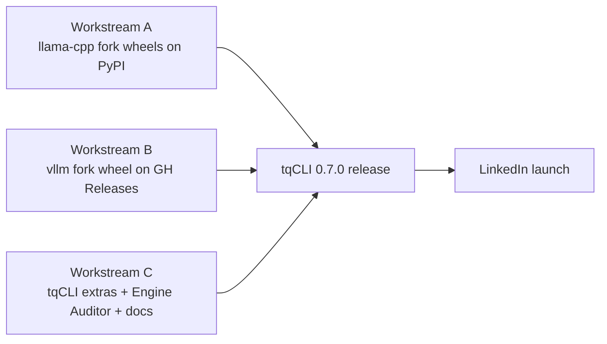

# Technical Implementation Plan: TurboQuant Fork Wheel Distribution

Companion to `docs/prd/PRD_turboquant_wheel_distribution.md`. Target release: **tqCLI 0.7.0**.

> **Status update 2026-04-27 (early UTC) — build phase live:** Both forks tagged. W-A cibuildwheel matrix in progress on GitHub Actions (CPU/Metal/sdist green; CUDA cells failed at `Jimver/cuda-toolkit@v0.2.16` — fast-follow with `@v0.2.19+` in 0.3.1-tq2). W-B GCP build kicked off on VM `vllm-tq-builder` (n2-standard-8, us-central1-a), now running in **detached tmux** as VM-self-driving (no local WSL2 dependency).
>
> **Three Phase 3 build bugs identified — backport required before next release:**
>
> 1. **`setuptools_scm` parser failure on non-PEP-440 git tag.** `setup.py` calls `setuptools_scm.get_version()` directly; with tag `v0.7.0-tq1`, `packaging.Version()` raises `InvalidVersion`. Editing pyproject's `dynamic` field doesn't fix this — wrong call path. **Fix (applied on VM):** `export SETUPTOOLS_SCM_PRETEND_VERSION=0.7.0.post20260426` before `python -m build`. **Backport:** add to `scripts/_build_one_wheel.sh` permanently.
>
> 2. **vLLM `setup.py` auto-throttles to `-j=1` under RAM pressure.** vLLM's `compute_num_jobs()` divides available RAM by ~7 GB/job. On n2-standard-8 (32 GB), even with `MAX_JOBS=4` set, cmake/ninja came out at `-j=1` — single-threaded build at ~25 files/hour, projecting 80–120h total. **Fix (applied on VM):** 16 GB swap file + explicit `MAX_JOBS=8`/`NVCC_THREADS=2`/`CMAKE_BUILD_PARALLEL_LEVEL=8`. **Backport:** force MAX_JOBS based on `nproc` not vLLM's heuristic + add swap-creation as build prerequisite. **Recommended VM size update: n2-standard-16 (64 GB)** for safer 4–8-way parallel — n2-standard-8 is right at the edge.
>
> 3. **`_build_one_wheel.sh` build-deps list incomplete for `--no-isolation` mode.** Missing `setuptools-scm`, `packaging`, `cmake`, `jinja2`, `numpy`; missing version pins (`setuptools<81`, `torch==2.10.0`). **Fix (applied on VM):** install full declared list verbatim from fork's `[build-system].requires`. **Backport:** derive deps list from pyproject.toml at runtime, don't hand-list.
>
> **Sunk cost on previous build attempts:** ~$5 of GCP compute (12h serial run + 2 short failed runs). Current run started 2026-04-27 ~01:58 UTC; if parallelism engaged, ETA ~10–14h to all 6 wheels. If still serial, would surface as next per-wheel `.fail` sentinel and require deeper intervention.
>
> **Phase 7 V2 (regression test on WSL2)** is no longer the canonical verification path — the build is now on GCP. The fork's RELEASING.md and the `tq-wheel-orchestrator` skill (added 2026-04-26) own the build-execution flow.

> **Status update 2026-04-26 (afternoon):** First `/project-manager` run completed; release PAUSED at prep phase. Findings:
> - **Phase 1 / A1 — BLOCKED.** Fork-target mismatch (see PRD update). `tqcli/llama-cpp-turboquant` is the C++ engine fork; the Python-bindings fork (`tqcli/llama-cpp-python-turboquant`) does not yet exist. Resolution requires creating the new repo + re-registering PyPI Pending Publisher.
> - **Phase 1 / B1 — STAGED.** Sentinels (`vllm/__init__.py.snippet`), runtime arch check (`vllm/turboquant_arch_check.py`), build scripts (`scripts/build_wheel_gcp.sh` + `_build_one_wheel.sh`), `docs/RELEASING.md`, release body template, RunPod verification commands all authored. Cross-repo application + golden-commit verification + tag deferred to maintainer.
> - **Phase 3 — pending.** GCP build (n2-standard-8 sequential, ~30h, ~$12) NOT kicked off. Holding until Workstream A is also resolved per Option-3 cohesive-launch decision.
> - **Phase 4 / Workstream C — DONE.** All Workstream C deliverables landed in branch `task-3-release-tqcli-1777190346`: engine_auditor + 15 passing tests, pyproject.toml extras, FUNDING.yml, community_verify.sh + workflow, all docs, CHANGELOG, release drafts. Blocked only on the Workstream B post-suffix pin.
> - **New skills:** `tq-pre-release-verify`, `tq-cross-repo-prep`, `tq-wheel-orchestrator`, `tq-release-conductor` at `.claude/skills/tq-*/`. These encode the lessons from this run and reduce risk on the next launch.

> **Status update 2026-04-26:** Sections 0.C + 0.D of the playbook closed; wheel-naming, GCP build strategy, and verification provider locked:
> - **0.C complete** — PyPI Pending Publisher registered for `llama-cpp-python-turboquant` (owner `tqcli`, repo `llama-cpp-turboquant`, workflow `wheels.yml`, environment Any). Auto-promotes Pending → Active on first run.
> - **0.D GCP** — project `tqcli-wheel-build` provisioned against billing account `01124B-E52669-78A9D0`. APIs enabled, $50 budget alert at 50/90/100%, bucket `gs://tqcli-wheel-build/` ready in us-central1. **Build path: sequential single n2-standard-8 VM** (no quota request); six wheels back-to-back, ~30h wall time, ~$12.
> - **0.D verification** — Vast.ai + Lambda Labs replaced by **RunPod** (`runpodctl`). V6 (sm_121, GB10) stays on the user's owned ASUS Ascent GX10.
> - **Phase 1 / B1 changes** — fork's `pyproject.toml` `name` is now build-time-templated (set per flavor by `scripts/build_wheel_gcp.sh`). `vllm/__init__.py` adds `TURBOQUANT_BUILD_ARCH` + `TURBOQUANT_BUILD_ARCH_LIST` (also build-time-templated). New module `vllm/turboquant_arch_check.py` exposes `check_arch_compatibility()` — called on first GPU init; raises `RuntimeError` with a clear message if the runtime GPU's compute capability doesn't match the wheel's arch list.
> - **Phase 3 changes** — single `vllm-turboquant` wheel becomes TWO: `vllm-turboquant` (sm_8.0/8.6/8.9/9.0) and `vllm-turboquant-blackwell` (sm_10.0/12.0/12.1+PTX). Build matrix is now 6 wheels (3 Python × 2 flavors), all sequential on one VM. Each wheel's arch list is narrower than the original single-wheel plan, so per-wheel build time is ~5h.
> - **Phase 4 / Workstream C changes** — `pyproject.toml` extras must reference both wheel names; `[vllm-tq]` extra resolves to whichever flavor matches the runtime GPU. Engine Auditor reports `TURBOQUANT_BUILD_ARCH` in its `--json` metadata; render_audit_warnings() includes the arch in the human-readable panel when a mismatch is detected.
> - **CUDA toolkit** — 13.0+ (12.8 cannot compile sm_121).
> - **`FUNDING.yml`** — `github: ithllc` only. ithllc = Ivey Technology Holdings LLC (user's business); tqCLI is a product of ithllc until spinout.
>
> The Phase 1 / Phase 3 / Phase 4 body sections need surgical updates to reflect the split (currently they describe a single `vllm-turboquant` wheel). Use this preamble as authoritative until those edits land.

> **Status update 2026-04-25:** Sections 0.A and 0.B of the playbook
> (`docs/prompts/ship_turboquant_wheels.md`) are complete:
> - GitHub org `tqcli` is live; repos transferred from `ithllc/`.
> - PyPI distribution name for the umbrella package is **`turboquant-cli`** (not
>   `tqcli`, which is taken by an unrelated project). Import name remains `tqcli`.
> - License switched from MIT to **Apache-2.0** for the umbrella `tqcli` package
>   (forks retain their inherited licenses: `llama-cpp-turboquant` is MIT,
>   `vllm-turboquant` is Apache-2.0). New artifacts at repo root: `LICENSE`,
>   `NOTICE`, `CITATION.cff`.
> - 0.0.0 placeholder published live at https://pypi.org/project/turboquant-cli/.
> - PyPI Trusted Publishing is wired up at `tqcli/tqcli:.github/workflows/publish-pypi.yml`
>   via OIDC (no API tokens). Same pattern is required for Phase 2 / Workstream A
>   on the `llama-cpp-turboquant` fork.
>
> Below this preamble, references to `pip install tqcli[...]` and to
> `ithllc/<repo>` are stale until Workstream C step 1 performs the global rename.
> The Phase 2 / A3 instructions (Trusted Publishing setup) should follow the
> tested `publish-pypi.yml` pattern; see the `tq-pypi` skill at
> `.claude/skills/tq-pypi/`.

## Overview
Ship the two TurboQuant forks (`ithllc/llama-cpp-turboquant`, `ithllc/vllm-turboquant`) as installable Python wheels under renamed PyPI packages (`llama-cpp-python-turboquant`, `vllm-turboquant`), wire them into `tqcli` via `[llama-tq]` / `[vllm-tq]` extras, add a runtime Engine Auditor that detects fork-vs-upstream mismatches, and cut the 0.7.0 release with a GitHub Sponsors link — so the LinkedIn launch lands with a one-command install that actually delivers TurboQuant KV compression.

**Release context (updated 2026-04-19):** 0.6.0 shipped agent modes (commit `c0457fd`); 0.6.1 shipped the Qwen 3 KV metadata calibrator; 0.6.2 shipped Llama 3 / Mistral / Phi-3 wrappers. Current tip is `0.6.2`. Wheel distribution is now a standalone **0.7.0** milestone. This TP's Workstream C bumps version from 0.6.2 to 0.7.0 and adds a new `[0.7.0]` CHANGELOG block at the top.

## Architecture

Three independent workstreams can run in parallel (use `project-manager` for worktree isolation):

- **Workstream A — `llama-cpp-python-turboquant` wheels**: rename, add `TURBOQUANT_BUILD` sentinel, set up `cibuildwheel` on GitHub Actions with PyPI Trusted Publishing, tag and release.
- **Workstream B — `vllm-turboquant` wheel**: rename, add `TURBOQUANT_ENABLED` sentinel, document the WSL2 one-off build, cut the first GitHub Release with the Gemma 4 + BNB_INT4 + CPU offload + turboquant35 commit pinned.
- **Workstream C — tqCLI 0.7.0 integration**: swap `pyproject.toml` extras, implement Engine Auditor, update docs, bump version, add `FUNDING.yml`.



Workstreams A and B produce artifacts consumed by Workstream C's `pyproject.toml` version pins — so C's final merge depends on both A and B shipping first, but C's implementation work (Engine Auditor, docs) can land in a draft PR in parallel.

**Execution order (2026-04-19 audit):** **B → A → C**. B is the most complex build (vLLM compile, 16-32 GB RAM, one-off WSL2), needs to stabilize first. A (cibuildwheel matrix) is mechanical once the fork has the sentinel + rename. C is the final integration.

## Phase 1: Package Renames and Fork Sentinels (Workstreams A + B in parallel)

### Objectives
Rename both forks' distribution metadata so PyPI/pip treat them as distinct packages, and add a one-attribute sentinel so tqCLI can distinguish fork from upstream at runtime without parsing version strings.

### Implementation Steps

**A1. llama-cpp-python-turboquant rename** (`ithllc/llama-cpp-turboquant`):
1. In the fork's `pyproject.toml`, change `name = "llama-cpp-python"` to `name = "llama-cpp-python-turboquant"`.
2. Preserve the import package name `llama_cpp` (no change to the `src/llama_cpp/` directory) so tqCLI's existing `from llama_cpp import Llama` keeps working.
3. Add to `src/llama_cpp/__init__.py`:
   ```python
   TURBOQUANT_BUILD = True
   TURBOQUANT_KV_TYPES = ("turbo2", "turbo3", "turbo4")
   ```
4. Update the fork's `README.md` top banner: "This is a fork of llama-cpp-python with TurboQuant KV cache compression. Install via `pip install llama-cpp-python-turboquant`. Not affiliated with the upstream `llama-cpp-python` project."

**B1. vllm-turboquant rename** (`ithllc/vllm-turboquant`):
1. In the fork's `pyproject.toml`, change `name = "vllm"` to `name = "vllm-turboquant"`.
2. Preserve import package name `vllm`.
3. Add to `vllm/__init__.py`:
   ```python
   TURBOQUANT_ENABLED = True
   TURBOQUANT_KV_DTYPES = ("turboquant25", "turboquant35")
   ```
4. Update fork `README.md` with equivalent banner.
5. Confirm the LICENSE file remains Apache 2.0 (inherited from upstream vLLM) and the NOTICE file credits upstream.

### Files
- `ithllc/llama-cpp-turboquant/pyproject.toml` (Modified)
- `ithllc/llama-cpp-turboquant/src/llama_cpp/__init__.py` (Modified)
- `ithllc/llama-cpp-turboquant/README.md` (Modified)
- `ithllc/vllm-turboquant/pyproject.toml` (Modified)
- `ithllc/vllm-turboquant/vllm/__init__.py` (Modified)
- `ithllc/vllm-turboquant/README.md` (Modified)

### Dependencies
None — these can run before any CI work.

### Verification
- `python -c "import llama_cpp; print(llama_cpp.TURBOQUANT_BUILD)"` prints `True` after local editable install of the fork.
- Same for `import vllm; print(vllm.TURBOQUANT_ENABLED)`.

---

## Phase 2: `cibuildwheel` Pipeline for `llama-cpp-python-turboquant` (Workstream A)

### Objectives
Automated, tag-triggered wheel builds across the full cross-platform matrix on free GitHub Actions runners, published to PyPI via Trusted Publishing.

### Implementation Steps

**A2. Wheel matrix.**
1. Create `.github/workflows/wheels.yml` in the llama fork using `pypa/cibuildwheel@v2.19`.
2. Matrix (free runners only):
   - `ubuntu-latest` × CPython 3.10/3.11/3.12 × `{CPU, CUDA 12.8}` (CUDA 12.1 dropped — TurboQuant kernels require 12.8+). Use `CIBW_MANYLINUX_X86_64_IMAGE: pytorch/manylinux-builder:cuda12.8` so `nvcc` is available *inside* the manylinux sandbox (Jimver-on-host CUDA does not survive into the cibuildwheel Docker container).
   - `windows-latest` × CPython 3.10/3.11/3.12 × `{CPU, CUDA 12.8}` — Windows cibuildwheel runs on the host, so `Jimver/cuda-toolkit@v0.2.30` is the supported install path.
   - `macos-14` (arm64) × CPython 3.10/3.11/3.12 × `{Metal}`
   - `macos-14` (arm64 runner) × `{x86_64 cross-build}` — **deferred to 0.7.1.** Upstream `CMakeLists.txt` `set(GGML_METAL ON ... FORCE)` overrides our `-DGGML_METAL=OFF` env vars; needs an upstream patch. Apple Silicon Metal cells cover ~85–90% of Macs sold since 2020. Tracked at `tqcli/llama-cpp-python-turboquant#3`.
3. Use `CIBW_ENVIRONMENT_*` (`|` literal block, NOT `>-` folded scalar) with double-quoted `CMAKE_ARGS` so embedded `;` in `-DCMAKE_CUDA_ARCHITECTURES=80;86;89;90` survives cibuildwheel's shell-style env-parser intact.
4. Linux CUDA cell **must** include `-DCMAKE_TRY_COMPILE_TARGET_TYPE=STATIC_LIBRARY` and embed `-L/usr/local/cuda/lib64` in `CMAKE_EXE_LINKER_FLAGS`. CMake's TryCompile probe runs in a sandbox where `LIBRARY_PATH` does not propagate; without these two flags any global `-l<lib>` flag fails the compiler-detection step before the project compiles.
5. Set `MAX_JOBS=2` and enable `ccache` to stay under the 16 GB / 4-vCPU runner limit.
6. Skip musllinux and i686 (`CIBW_SKIP = "*-musllinux* *-manylinux_i686"`).

**A2.5. Wheel repair — bundled vs PyPI-extra CUDA libs.**

Linux and Windows take different approaches because the wheel-size and DLL-loader trade-offs differ:

- **Linux: PyTorch +cuXXX pattern (CUDA libs from PyPI extra).**
  `auditwheel repair --plat manylinux2014_x86_64 --exclude libcudart.so.12 --exclude libcublas.so.12 --exclude libcublasLt.so.12 -w {dest_dir} {wheel}` keeps the wheel small. `patchelf --add-rpath '$ORIGIN/../../nvidia/cuda_runtime/lib:$ORIGIN/../../nvidia/cublas/lib'` on every `.so` inside the repaired wheel makes the C extension find pip-installed nvidia/* at runtime. End user runs `pip install llama-cpp-python-turboquant[cuda12]` to pull `nvidia-cuda-runtime-cu12==12.8.57` + `nvidia-cublas-cu12==12.8.3.14` from PyPI. Implemented as `scripts/repair_linux_wheel.sh` invoked by `CIBW_REPAIR_WHEEL_COMMAND_LINUX`.
- **Windows: bundled DLLs (delvewheel).**
  `delvewheel repair --add-path "C:/Program Files/NVIDIA GPU Computing Toolkit/CUDA/v12.8/bin" -w {dest_dir} {wheel}` bundles `cudart64_12.dll` + `cublas64_12.dll` + transitive deps into `llama_cpp.libs/`. The `--add-path` arg points delvewheel at Jimver's installed location. A 16-line `os.add_dll_directory(<wheel_root>/llama_cpp.libs)` stub at the top of `llama_cpp/__init__.py` registers the bundled directory before the C extension loads (Python 3.8+ disabled PATH-based DLL resolution). End user runs `pip install llama-cpp-python-turboquant` — no extras, no toolkit install.

**A2.6. Test rigor — no scope-cut.**

`CIBW_TEST_COMMAND` runs the full `import llama_cpp; assert llama_cpp.TURBOQUANT_BUILD is True; assert llama_cpp.TURBOQUANT_KV_TYPES == ('turbo2','turbo3','turbo4')` against the actually-loaded wheel. `CIBW_BEFORE_TEST_LINUX` and `CIBW_BEFORE_TEST_WINDOWS` install `nvidia-cuda-runtime-cu12==12.8.57 nvidia-cublas-cu12==12.8.3.14` so the test venv has CUDA libs available. **Do not** weaken the test to a source-file text-read — that would bypass wheel-corruption detection (see `feedback_no_scope_cut.md`).

**A3. PyPI Trusted Publishing.**
1. Register the PyPI project `llama-cpp-python-turboquant` (owner: tqcli).
2. Configure Trusted Publisher with repo `tqcli/llama-cpp-python-turboquant`, workflow `wheels.yml`, environment `(none)`.
3. Add a `publish` job at the end of `wheels.yml` using `pypa/gh-action-pypi-publish@release/v1` — no `PYPI_API_TOKEN` secret needed. Job needs `permissions: id-token: write`.

**A4. Release tag trigger.**
1. Workflow triggers on `push: tags: ['v*']`.
2. Use `softprops/action-gh-release@v2` to attach the same wheels to the GitHub Release page (for users who prefer `--find-links`).
3. Apply iter-N+1 patches via atomic `gh api git/trees + git/commits + git/refs` (no clone, no local build) so the patch survives WSL2 reboot mid-flight. See `tq-wheel-build-audit` skill for the audit-then-patch pattern.

### Files
- `tqcli/llama-cpp-python-turboquant/.github/workflows/wheels.yml` (Created)
- `tqcli/llama-cpp-python-turboquant/pyproject.toml` — `[project.optional-dependencies] cuda12 = ["nvidia-cuda-runtime-cu12==12.8.57", "nvidia-cublas-cu12==12.8.3.14"]` (added in iter #12 / `v0.3.1-tq3`)
- `tqcli/llama-cpp-python-turboquant/llama_cpp/__init__.py` — Windows DLL-directory stub (16 lines at top, before `from .llama_cpp import *`)
- `tqcli/llama-cpp-python-turboquant/scripts/repair_linux_wheel.sh` (new) — auditwheel `--exclude` + patchelf RPATH wrapper
- `tqcli/llama-cpp-python-turboquant/.ccache/` ignored via `.gitignore`

### Dependencies
- Phase 1 (rename must land first or PyPI project creation targets the wrong name).
- `delvewheel` and `patchelf` available in the build environment. `delvewheel` is added to `CIBW_BEFORE_BUILD: python -m pip install --upgrade pip cmake ninja scikit-build-core delvewheel`. `patchelf` ships in `pytorch/manylinux-builder:cuda12.8`.

### Verification
- Tag `v0.3.1-tq3` on the fork → `wheels.yml` runs to green for all 16 matrix cells (sdist + 6 Linux + 6 Windows + 3 macOS Metal) → PyPI shows wheels.
- Linux CUDA: `pip install llama-cpp-python-turboquant[cuda12]` on a clean Ubuntu venv with NO system CUDA toolkit → `python -c "import llama_cpp; assert llama_cpp.TURBOQUANT_BUILD is True; print('OK')"` prints OK.
- Windows CUDA: `pip install llama-cpp-python-turboquant` on a clean Windows venv with NO system CUDA toolkit → same import test passes (DLLs bundled).
- Linux/Windows CPU: `pip install llama-cpp-python-turboquant` with no extras → import test passes.
- macOS arm64: `pip install llama-cpp-python-turboquant` → import test passes.

---

## Phase 3: Manual One-Off Wheel Build for `vllm-turboquant` (Workstream B)

### Objectives
Produce a single, reproducible `vllm-turboquant` wheel that captures the exact commit with Gemma 4 + BNB_INT4 + CPU offload + turboquant35 verified working, without spending any money.

### Implementation Steps

**B2. Pin the golden commit.**
1. Identify the commit SHA on `ithllc/vllm-turboquant` AFTER Issue #22's four-patch page-size-unification fix landed (see `patches/vllm-turboquant/issue_22_page_size_fix.md` for patch bodies). The pre-patch 2026-04-17 run is stale and reproduces Issue #22's head_dim mismatch; use a post-patch commit.
2. Verify the chosen SHA runs both: (a) Gemma 4 E2B + BNB_INT4 + CPU offload + turboquant35 (Section C.2 of the comparison report), AND (b) Qwen 3 4B + calibrated `turboquant_kv.json` (the 0.6.1 path). Both must be green.
3. Tag it `v0.7.0-tq1` on the fork.

**B3. WSL2 build script** (`scripts/build_wheel_wsl2.sh` in the vllm fork):
```bash
#!/usr/bin/env bash
set -euo pipefail
# Prerequisites: CUDA 12.8 toolkit, gcc-11, 32 GB RAM, ~60 GB free disk.
python -m venv .build-venv
source .build-venv/bin/activate
pip install --upgrade pip build wheel setuptools "torch>=2.4" ninja
export MAX_JOBS=4           # tune to box
export NVCC_THREADS=4
export VLLM_TARGET_DEVICE=cuda
export TORCH_CUDA_ARCH_LIST="8.0 8.6 8.9 9.0"   # Ampere+
python -m build --wheel --outdir dist/
sha256sum dist/*.whl > dist/SHA256SUMS
```

**B4. One-off build, three wheels.**
1. Maintainer runs the script three times in fresh venvs for CPython 3.10, 3.11, 3.12.
2. Collect `dist/*.whl` + `SHA256SUMS`.

**B5. GitHub Release.**
1. `gh release create v0.7.0-tq1 --repo ithllc/vllm-turboquant --title "vllm-turboquant 0.7.0-tq1 (Gemma 4 + BNB_INT4 + CPU offload + turboquant35 + Qwen 3 calibrator)"`.
2. Attach the three `.whl` files and `SHA256SUMS`.
3. Release body: paste the Section C.2 integration numbers verbatim as the provenance story.

**B6. Install URL.**
1. Confirm that `pip install vllm-turboquant --find-links https://github.com/ithllc/vllm-turboquant/releases/expanded_assets/v0.7.0-tq1` resolves on a clean CUDA 12.8 Ubuntu box.
2. Document this as the exact invocation users run.

### Files
- `ithllc/vllm-turboquant/scripts/build_wheel_wsl2.sh` (Created)
- `ithllc/vllm-turboquant/docs/RELEASING.md` (Created — maintainer runbook)
- `ithllc/vllm-turboquant/dist/` (gitignored)

### Dependencies
- Phase 1 (rename must land first).

### Verification
- `pip install vllm-turboquant --find-links <release-url>` on a fresh WSL2 box with a 4 GB Ampere GPU succeeds and `python -c "import vllm; print(vllm.TURBOQUANT_ENABLED)"` prints `True`.
- `tqcli chat --model gemma-4-e2b-it-vllm --engine vllm --kv-quant turbo3 --prompt "Paris?" --json` emits the Section C.2 metadata block (cpu_offload_gb, kv_cache_dtype=turboquant35).

---

## Phase 4: tqCLI `pyproject.toml` Rewrite (Workstream C)

### Objectives
Replace the upstream-pulling extras with TurboQuant-only extras, bump the version, and make `pip install tqcli[all]` the canonical "give me everything" path.

### Implementation Steps

**C1. Replace extras.** In `pyproject.toml`:

```toml
[project]
version = "0.7.0"

[project.optional-dependencies]
llama-tq = [
    "llama-cpp-python-turboquant>=0.3.0",
]
vllm-tq = [
    "vllm-turboquant==0.7.0.postYYYYMMDD",  # pin commit AFTER Issue #22 four-patch fix; YYYYMMDD = pinned commit date
    "bitsandbytes>=0.43.0",
    "accelerate>=0.30.0",
]
all = ["tqcli[llama-tq,vllm-tq]"]
dev = ["pytest>=7.0", "ruff>=0.4"]
```

Delete the old `llama` and `vllm` keys entirely.

**C2. Version bump.**
1. `pyproject.toml`: bump `version` from `0.6.2` to `0.7.0`.
2. `tqcli/__init__.py`: bump fallback `__version__` from `0.6.2` to `0.7.0`.
3. `tqcli/cli.py`: confirm `--version` flag reads from `__version__`.

**C2a. Dependency harmony check (new, added per gemini review 2026-04-18).** Before declaring Workstream C done, on a fresh venv:
```bash
pip install -e ".[vllm-tq]" --find-links <vllm-turboquant-release>
pip install -e ".[dev]"
python -m pytest tests/test_agent_orchestrator.py -x
python tests/test_integration_agent_modes.py
```
Verify that the vllm-turboquant wheel's pinned `torch` / `numpy` / `pydantic` do not downgrade anything the agent orchestrator depends on. If any of the agent unit tests fail after the wheel is installed but pass with upstream vllm, that's a blocking regression.

### Files
- `pyproject.toml` (Modified)
- `tqcli/__init__.py` (Modified)

### Dependencies
- Phases 2 and 3 must have published the wheels under the pinned versions before this PR can be merged to main (draft PR is fine in parallel).

### Verification
- On a fresh venv: `pip install -e ".[vllm-tq]"` pulls `vllm-turboquant` (via `--find-links` configured in user docs) and `import vllm; vllm.TURBOQUANT_ENABLED` is `True`.
- `pip install -e ".[llama-tq]"` pulls from PyPI directly, no `--find-links` needed.
- `tqcli --version` prints `tqcli, version 0.7.0`.

---

## Phase 5: Engine Auditor (Workstream C)

### Objectives
At every `tqcli` startup, detect whether the loaded engines are TurboQuant forks or upstream, cross-reference with hardware capability, and print a loud colored message when there's a fixable mismatch. Stay silent when the user is already correctly configured or when their hardware cannot run TurboQuant regardless.

### Implementation Steps

**C3. New module `tqcli/core/engine_auditor.py`.**

```python
from __future__ import annotations
from dataclasses import dataclass
from .system_info import SystemInfo, check_turboquant_compatibility

@dataclass
class EngineAuditResult:
    engine: str                   # "llama.cpp" or "vllm"
    is_turboquant_fork: bool      # True if sentinel detected
    hardware_capable: bool        # True if CUDA >= 12.8 and SM >= 8.6 (or Metal for llama)
    should_warn: bool             # True iff hardware_capable and not is_turboquant_fork
    install_hint: str             # exact pip command to fix

def audit_llama_cpp(system: SystemInfo) -> EngineAuditResult | None:
    try:
        import llama_cpp
    except ImportError:
        return None
    is_fork = getattr(llama_cpp, "TURBOQUANT_BUILD", False) is True
    capable = (system.has_nvidia_gpu and check_turboquant_compatibility(system).supported) \
              or system.has_metal
    return EngineAuditResult(
        engine="llama.cpp",
        is_turboquant_fork=is_fork,
        hardware_capable=capable,
        should_warn=(capable and not is_fork),
        install_hint="pip install --upgrade 'tqcli[llama-tq]'",
    )

def audit_vllm(system: SystemInfo) -> EngineAuditResult | None:
    try:
        import vllm
    except ImportError:
        return None
    is_fork = getattr(vllm, "TURBOQUANT_ENABLED", False) is True
    capable = check_turboquant_compatibility(system).supported
    return EngineAuditResult(
        engine="vllm",
        is_turboquant_fork=is_fork,
        hardware_capable=capable,
        should_warn=(capable and not is_fork),
        install_hint=(
            "pip install --upgrade 'tqcli[vllm-tq]' "
            "--find-links https://github.com/ithllc/vllm-turboquant/releases/latest"
        ),
    )

def run_audit(system: SystemInfo) -> list[EngineAuditResult]:
    return [r for r in (audit_llama_cpp(system), audit_vllm(system)) if r is not None]
```

**C4. Console rendering.** In `tqcli/ui/console.py`, add `render_audit_warnings(results, console)` that prints a single Rich `Panel` (yellow border) for each `should_warn=True` result:

```
╔══ TurboQuant Unavailable ═══════════════════════════════╗
║ Your GPU supports TurboQuant KV compression but your    ║
║ installed vLLM is upstream (no turboquant35 kernel).    ║
║                                                         ║
║ Fix:                                                    ║
║   pip install --upgrade 'tqcli[vllm-tq]' \              ║
║     --find-links https://github.com/ithllc/...          ║
║                                                         ║
║ Continuing with kv:none fallback.                       ║
╚═════════════════════════════════════════════════════════╝
```

**C5. Wire-up.** In `tqcli/cli.py`:
- Call `run_audit(get_system_info())` once per CLI invocation before dispatching to subcommands.
- Skip the audit when `TQCLI_SUPPRESS_AUDIT=1` (so CI and `--json` users can silence it).
- In `--json` mode, emit the audit as part of the metadata object on stderr, not as a visual panel.
- **Ordering contract with the agent orchestrator (added per gemini review 2026-04-18):** when `--ai-tinkering` or the unrestricted flag is active, `render_audit_warnings()` MUST finish writing to stderr AND `console.file.flush()` MUST be called BEFORE `InteractiveSession` instantiates the `AgentOrchestrator`. Otherwise, Rich's buffered output can interleave with the orchestrator's streamed tool-call tags, producing a garbled stream that confuses both the user and any downstream parser. Add an `assert` in a unit test that captures `sys.stderr` and verifies the panel's final newline appears before the first orchestrator stream chunk.
- **Internal API for agent tools (added per gemini review 2026-04-18):** expose `engine_auditor.get_status() -> dict[str, EngineAuditResult]` (module-level, cached after the first call) so a future agent tool can report authoritative TurboQuant status to the LLM without re-importing `vllm` / `llama_cpp`. Not wired in this release; the hook is a one-line addition to the module that unblocks later work.

**C6. Tests.** `tests/test_engine_auditor.py`:
- Mock `llama_cpp` with and without `TURBOQUANT_BUILD`; assert `is_turboquant_fork` flips.
- Mock `SystemInfo` with SM 8.6 / CUDA 12.8 vs. SM 7.5; assert `should_warn` flips.
- Integration test: run `tqcli system info` in a venv with upstream `vllm` on a capable GPU; assert the warning panel renders exactly once to stderr.

### Files
- `tqcli/core/engine_auditor.py` (Created)
- `tqcli/ui/console.py` (Modified — new `render_audit_warnings`)
- `tqcli/cli.py` (Modified — invoke audit on startup)
- `tests/test_engine_auditor.py` (Created)

### Dependencies
- Phase 1 (sentinels must exist in the forks for the detection to work).
- Phase 4 (version bump to reference 0.7.0 in install hints).

### Verification
- Manual: on a WSL2 box with upstream `vllm` installed on an Ampere GPU, `tqcli system info` prints the yellow panel with the correct pip command to stderr.
- Manual: after `pip install tqcli[vllm-tq]` with the real fork, the panel disappears.
- Manual: on a Pascal GPU (SM 6.1) with upstream vllm, the panel stays suppressed because hardware is not capable.

---

## Phase 6: Documentation, Sponsors, and CHANGELOG (Workstream C)

### Objectives
Update every user-facing doc to the new install path, add the GitHub Sponsors config, and write the 0.7.0 changelog entry.

### Implementation Steps

**C7. `.github/FUNDING.yml`:**
```yaml
github: [ithllc]
```

**C8. `README.md` edits:**
- Add "What's new in 0.7.0" section at the top mirroring the 0.6.x style.
- Replace every `pip install -e ".[llama]"` / `[vllm]` / `[all]` with the `-tq` variants.
- Add a note for vLLM: `--find-links https://github.com/ithllc/vllm-turboquant/releases/latest`.
- Add a "Supported hardware for TurboQuant KV" mini-table (already in architecture doc; duplicate just the install-decision subset here).

**C9. `docs/GETTING_STARTED.md` edits:**
- Step 1 install block replaced.
- Platform-specific sections (macOS, Linux, WSL2, Windows) updated.
- Troubleshooting table adds: "Seeing the yellow 'TurboQuant Unavailable' panel? → Run the pip command from the panel."

**C10. `docs/architecture/turboquant_kv.md` and `docs/architecture/inference_engines.md`:**
- Add a "Distribution" section in `turboquant_kv.md` linking to:
  - PyPI: `https://pypi.org/project/llama-cpp-python-turboquant/`
  - GH Release: `https://github.com/ithllc/vllm-turboquant/releases/latest`
- In `inference_engines.md`, document the `TURBOQUANT_BUILD` / `TURBOQUANT_ENABLED` sentinels and the Engine Auditor's role.

**C11. `docs/examples/USAGE.md`:**
- Update the `[vllm]` install example to `[vllm-tq]` with the `--find-links` flag.

**C12. `docs/contributing/RELEASING_WHEELS.md` (new):**
- Step-by-step maintainer runbook for cutting a new `vllm-turboquant` wheel from WSL2 (mirrors Phase 3, for future releases).

**C13. `CHANGELOG.md` — ADD a new `[0.7.0]` block at the top** (above the existing `[0.6.2]` block). Do not touch the 0.6.0 / 0.6.1 / 0.6.2 blocks — they're shipped history.

```markdown
## [0.7.0] - YYYY-MM-DD

### Added
- **TurboQuant fork wheels** — `llama-cpp-python-turboquant` on PyPI (Linux/macOS/Windows,
  CPU + CUDA 12.8 + Metal), `vllm-turboquant` as a GitHub Release asset
  (Linux x86_64 + CUDA 12.8). Pinned to the commit AFTER Issue #22's
  four-patch page-size fix — see `patches/vllm-turboquant/issue_22_page_size_fix.md`.
- **Engine Auditor** (`tqcli/core/engine_auditor.py`) — detects fork-vs-upstream
  on startup, prints a high-visibility panel when the GPU supports TurboQuant
  but an upstream engine is installed. Flushes before the agent orchestrator's
  first stream in agent modes. Exposes `get_status()` for future agent-tool use.
- **GitHub Sponsors** — `.github/FUNDING.yml`.

### Changed
- `pyproject.toml` extras replaced: `[llama]` / `[vllm]` / `[all]` → `[llama-tq]` /
  `[vllm-tq]` / `[all]`. The old names no longer install anything. macOS users
  must install `[llama-tq]` directly — `[all]` has no Darwin wheel path for vLLM.

### Removed
- Upstream `llama-cpp-python` and `vllm` dependency paths. tqCLI now ships
  exclusively against the TurboQuant forks.
```

### Files
- `.github/FUNDING.yml` (Created)
- `README.md` (Modified)
- `docs/GETTING_STARTED.md` (Modified)
- `docs/architecture/turboquant_kv.md` (Modified)
- `docs/architecture/inference_engines.md` (Modified)
- `docs/examples/USAGE.md` (Modified)
- `docs/contributing/RELEASING_WHEELS.md` (Created)
- `CHANGELOG.md` (Modified)

### Dependencies
- Phase 4 (extras must be final so docs can reference them accurately).
- Phase 5 (Engine Auditor must exist for troubleshooting docs to describe it correctly).

### Verification
- `architecture-doc-review` skill run against all updated architecture docs — no outstanding drift flagged.
- Sponsor button visible on the repo landing page within 24 hours of merging `FUNDING.yml`.

---

## Phase 7: End-to-End Verification and Release Cut

### Objectives
Prove the full story works end-to-end before tagging and announcing.

### Implementation Steps

**V1. Clean-install matrix test.** On each of:
- Ubuntu 22.04 + RTX 3060 + CUDA 12.8 (vLLM fork path)
- WSL2 + RTX A2000 + CUDA 12.8 (vLLM fork path — maintainer's own machine)
- macOS arm64 M-series (llama.cpp fork Metal path)
- Linux x86_64 CPU-only (llama.cpp fork CPU path)
- Windows 11 + RTX 3060 + CUDA 12.8 (llama.cpp fork CUDA path)
  
  run:
  ```bash
  python -m venv fresh && source fresh/bin/activate
  pip install tqcli[all] --find-links https://github.com/ithllc/vllm-turboquant/releases/latest
  tqcli system info
  tqcli chat --kv-quant turbo3 --prompt "Two plus two?" --json
  # Agent-mode smoke (non-negotiable per gemini review 2026-04-18):
  tqcli chat --ai-tinkering < /dev/null   # must fail fast with click.UsageError when stdin is closed, NOT hang
  tqcli --stop-trying-to-control-everything-and-just-let-go chat \
        --prompt "Emit plain text: done." --max-agent-steps 2
  ```
  Assert:
  - Engine Auditor stays silent on capable hardware with the forks installed.
  - `--json` response includes TurboQuant metadata; exit code 0.
  - `--ai-tinkering` with closed stdin exits non-zero fast (no hang). This
    guards the `--json + --ai-tinkering` fail-fast contract added in `c0457fd`.
  - Unrestricted headless run terminates within `max_agent_steps` without
    leaving orphan vLLM worker processes.

**V2. Regression pass.** Run the full existing integration suite from `tests/integration_reports/turboquant_kv_comparison_report.md` on the maintainer's WSL2 box. All 7/7 tests must stay green, specifically test_7 (Gemma 4 E2B + BNB_INT4 + CPU offload + turboquant35).

**V3. Tag and release.**
1. `git tag v0.7.0 && git push --tags` on the tqCLI main branch.
2. `gh release create v0.7.0` on ithllc/tqCLI with the CHANGELOG 0.7.0 body. The release body leads with: (a) `llama-cpp-python-turboquant` PyPI install one-liner, (b) `vllm-turboquant` GitHub-Releases install one-liner. One release, one LinkedIn post.
3. Publish `llama-cpp-python-turboquant` via the Phase 2 workflow (tag `v0.3.0-tq1` on the fork).
4. Verify `vllm-turboquant` Phase 3 release is attached and discoverable.

**V4. Launch gate.** Only after V1–V3 pass clean: draft the LinkedIn post (separate deliverable — not part of this plan).

### Files
None — verification only.

### Dependencies
All prior phases.

### Verification
All five platform matrix cells in V1 return exit code 0 with the expected TurboQuant metadata in the JSON response.

---

## Risk Register

| Risk | Likelihood | Impact | Mitigation |
|------|------------|--------|------------|
| vLLM wheel build OOMs on maintainer's WSL2 box | Medium | High | Reduce `MAX_JOBS` to 2; enable swap to 32 GB; worst case fall back to `ubuntu-latest-16-core` via GitHub's "larger runners for open source" program (free if approved). |
| PyPI rejects `llama-cpp-python-turboquant` as a "fork / squatting" name | Low | Medium | Clear banner on PyPI description stating it's an unofficial fork; preemptively link upstream. PyPI's policy historically allows clearly-marked forks. |
| `cibuildwheel` CUDA matrix exceeds free runner time budget | Medium | Medium | Split CUDA variants into a separate workflow; enable `ccache`; skip i686/musllinux. |
| Users on CUDA < 12.8 install the vllm fork and hit runtime crashes | Low | High | Engine Auditor and `check_turboquant_compatibility` already gate at runtime; add a `pre-install` check in the fork's `setup.py` that warns (not errors) if CUDA is < 12.8. |
| PyPI Trusted Publishing OIDC setup fails on first tag push | Medium | Low | Document manual fallback: one-time API token + `twine upload` from the maintainer's box. |
| Users on macOS expect vLLM and install `[all]` on a Mac | Medium | Low | `[all]` extra's `vllm-turboquant==...` will fail to resolve a wheel on macOS — document clearly that macOS users should use `[llama-tq]`, not `[all]`. Engine Auditor also stays silent on Mac re: vLLM. |
| **Engine Auditor panel interleaves with orchestrator stream output** (added 2026-04-18 per gemini review) | Medium | Medium | Enforce the Phase 5 C5 ordering contract: `render_audit_warnings()` must `console.file.flush()` BEFORE `AgentOrchestrator.__init__`. Add a unit test that captures stderr and asserts the panel's final newline precedes the first stream chunk. |
| **vllm-turboquant wheel's pinned torch/numpy/pydantic downgrades agent orchestrator deps** (added 2026-04-18 per gemini review) | Medium | High | Run the Phase 4 C2a dependency-harmony check before release. If `tests/test_agent_orchestrator.py` fails with the fork installed but passes with upstream, block the release until deps are reconciled in one of the wheels. |
| **Docker image ships upstream vllm because Dockerfile wasn't updated** | Low | Medium | Section 8 of the PRD now mandates the Docker layer update; CI should build the image and run `pip show llama-cpp-python-turboquant vllm-turboquant` as a smoke step. |
| **Linux CUDA wheel build depends on `pytorch/manylinux-builder:cuda12.8` (third-party image)** (added 2026-04-27 — Path A trade-off in W-A v0.3.1-tq2) | Medium | High | If the image is deleted or PyTorch stops publishing the cuda12.8 tag, all Linux CUDA wheel builds break. **Path B (0.7.1):** switch to canonical `quay.io/pypa/manylinux_2_28_x86_64` and install CUDA inside the container via `CIBW_BEFORE_ALL_LINUX` (DNF on AlmaLinux 8). Tracked at [tqcli/llama-cpp-python-turboquant#3](https://github.com/tqcli/llama-cpp-python-turboquant/issues/3). |
| **macOS x86_64 cross-build picks up host arm64 SIMD flags** (added 2026-04-27) | High when first encountered | High | llama.cpp's `GGML_NATIVE=ON` default emits `-mcpu=apple-m1` even when targeting x86_64. Workflow now sets `CMAKE_ARGS="-DGGML_NATIVE=OFF -DGGML_AVX=ON -DGGML_AVX2=ON -DGGML_FMA=ON"` for the macOS cpu variant (cross-built from arm64). Intel Mac SIMD baseline of AVX/AVX2/FMA covers every Mac shipped since ~2013. |
| **V5 (B200) RunPod capacity drops to zero before launch** (added 2026-04-27) | Medium (observed once) | Low (correctness) / Medium (marketing) | RunPod's GraphQL inventory showed B200 at $5.98/hr on 2026-04-26 but `onDemandPrice=None spotPrice=None` on 2026-04-27. V4 (RTX 5090, sm_12.0) verifies the same `vllm-turboquant-blackwell` wheel; B200 `cubin` is present via the build-time `TORCH_CUDA_ARCH_LIST="10.0 12.0 12.1+PTX"`. Defer V5 to 0.7.1 — track at [tqcli/tqcli#41](https://github.com/tqcli/tqcli/issues/41). For future launches, snapshot RunPod inventory at T-2 days *and* T-0 to catch capacity drops, and pre-identify Lambda Labs / Crusoe as fallback B200 providers. |

## Rollback Plan

If the 0.7.0 release breaks installs in the wild:
1. Yank `tqcli==0.7.0` from PyPI (`twine upload --skip-existing` doesn't help; use PyPI UI "yank" button).
2. Tag a `0.7.1` hotfix that restores the `[llama]` / `[vllm]` extras as aliases for `[llama-tq]` / `[vllm-tq]` so existing copy-pasted README snippets still work.
3. Do not delete the GitHub Release for `vllm-turboquant` — users mid-download need stability.
